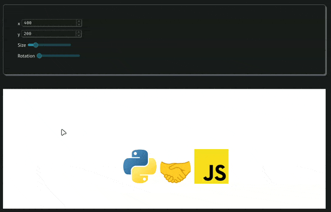

# logo-widget

[](https://gist.github.com/cheerfulstoic/d107229326a01ff0f333a1d3476e068d)

Custom Python widget to move/scale/rotate a logo, using [Anywidget](https://anywidget.dev/)



```bash
uv run marimo edit
```